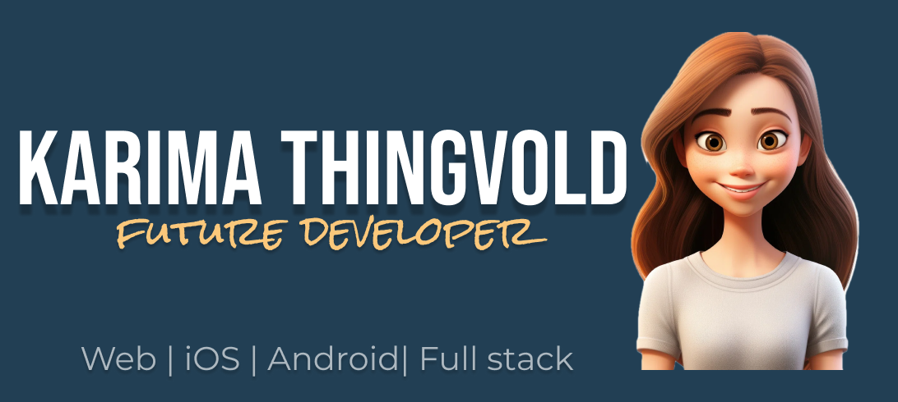

 Hi there 👋 and welcome to my GitHub page. 
 

Contact me on:

👩‍🎓 I'm in my last year of a three-year bachelor's degree in Information technology - Frontend and mobile development 📱

While balancing my studies and exam preparations, I am currently working on futher developing an iOS application that showcases Norwegian tourist attractions through an interactive map using MapKit 📍 Additionally, I am building a personal portfolio website to highlight my skills and projects ✨

---

🔭 This autumn I am learning:  

and learning how to develop hybrid applications that can be deployed to multiple mobile platforms using React Native for cross-platform development ✨

---
Previous exams:

---

<!--
**kath0809/kath0809** is a ✨ _special_ ✨ repository because its `README.md` (this file) appears on your GitHub profile.

Here are some ideas to get you started:

- 🔭 I’m currently working on ...
- 🌱 I’m currently learning ...
- 👯 I’m looking to collaborate on ...
- 🤔 I’m looking for help with ...
- 💬 Ask me about ...
- 📫 How to reach me: ...
- 😄 Pronouns: ...
- ⚡ Fun fact: ...
-->
